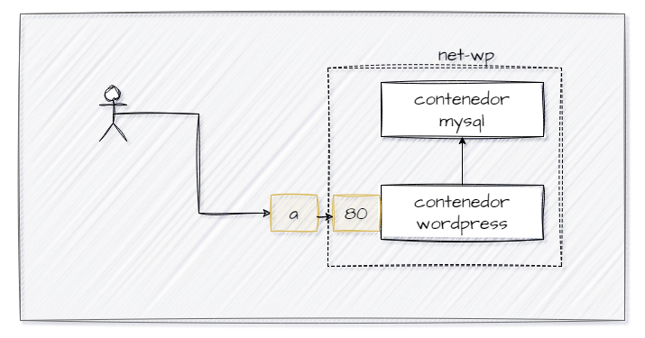

## Esquema para el ejercicio


### Crear la red
# COMPLETAR
```
docker network create wp -d bridge
```
### Crear el contenedor mysql a partir de la imagen mysql:8, configurar las variables de entorno necesarias
# COMPLETAR
```
docker run --name contenedorMYSQL --env-file=variablesEntorno.env --network wp -d mysql:8
```
### Crear el contenedor wordpress a partir de la imagen: wordpress, configurar las variables de entorno necesarias
# COMPLETAR
```
docker run --name contenedorWordPress --env-file=variablesEntorno.env --network wp -P -d wordpress
```
# Extra


De acuerdo con el trabajo realizado, en la el esquema de ejercicio el puerto a es: 9300

Ingresar desde el navegador al wordpress y finalizar la configuración de instalación.
# COLOCAR UNA CAPTURA DE LA CONFIGURACIÓN


Desde el panel de admin: cambiar el tema y crear una nueva publicación.
Ingresar a: http://localhost:9300/ 
recordar que a es el puerto que usó para el mapeo con wordpress
# COLOCAR UNA CAPTURA DEL SITO EN DONDE SEA VISIBLE LA PUBLICACIÓN.


### Eliminar el contenedor wordpress
# COMPLETAR
```
docker rm contenedorWordPress -f
```
### Crear nuevamente el contenedor wordpress
Ingresar a: http://localhost:9300/ 
recordar que a es el puerto que usó para el mapeo con wordpress

### ¿Qué ha sucedido, qué puede observar?
# COMPLETAR


Se quedó guardada la página que estaba personalizando.


